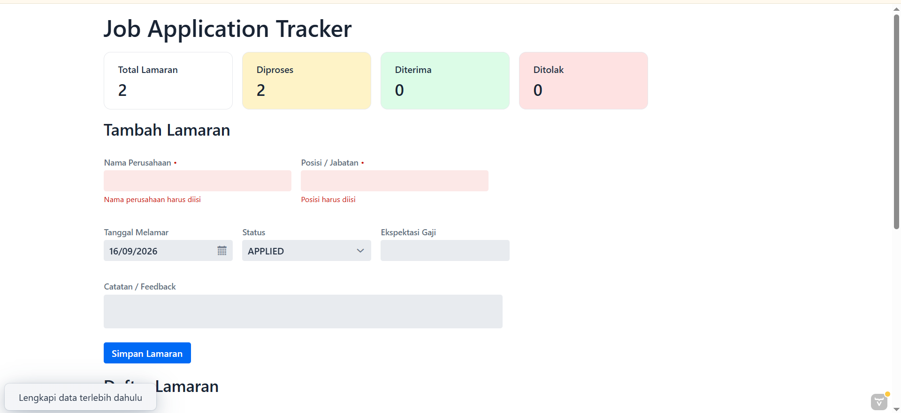
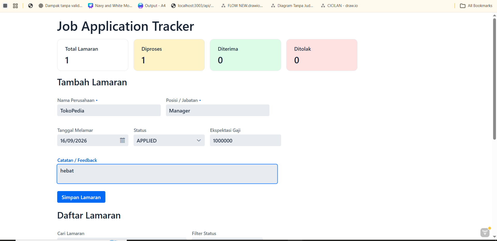
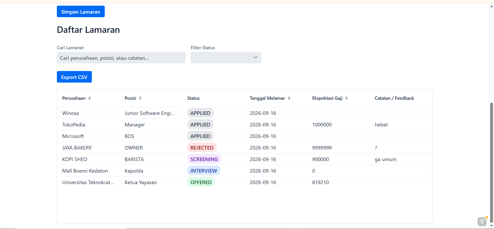
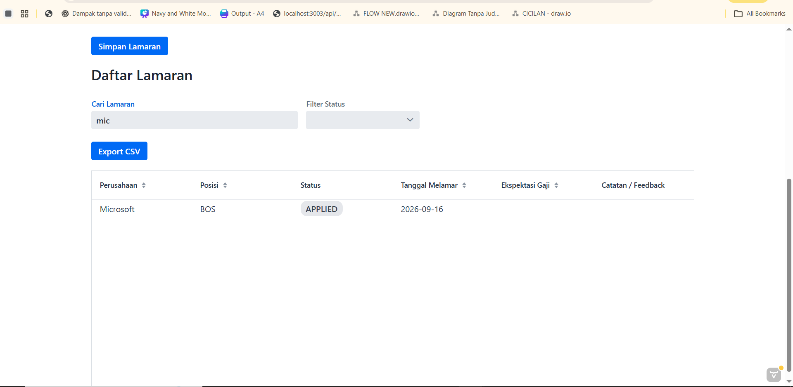
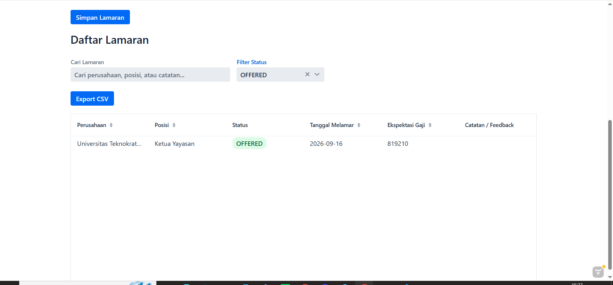
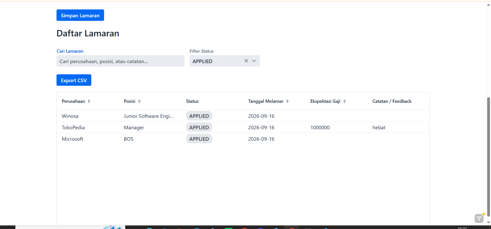
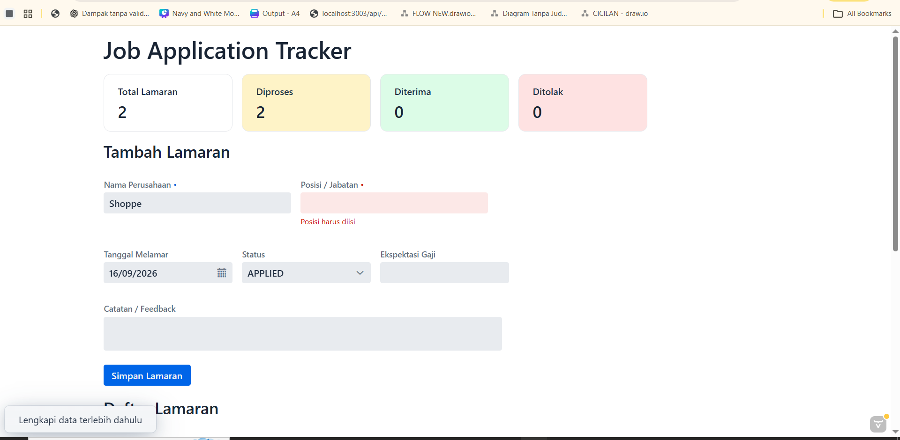
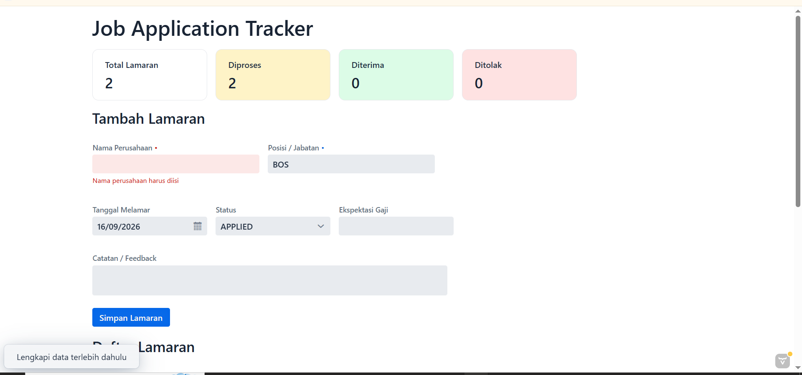

# Personal Job Application Tracker

Personal Job Application Tracker adalah aplikasi berbasis web untuk mencatat, mengelola, dan memantau proses lamaran kerja.

Aplikasi dibangun menggunakan **Java 21, Spring Boot, Vaadin, Spring Data JPA, dan H2 Database**. Pengguna dapat menyimpan data lamaran, memantau status proses rekrutmen, melakukan pencarian dan filter data, melihat ringkasan lamaran melalui dashboard, serta mengekspor data ke dalam format CSV.

---

## Fitur Utama

### 1. Manajemen Data Lamaran

Pengguna dapat menambahkan data lamaran yang terdiri dari:

- Nama Perusahaan
- Posisi / Jabatan
- Tanggal Melamar
- Status Lamaran
- Ekspektasi Gaji
- Catatan / Feedback

Data yang berhasil disimpan akan langsung ditampilkan pada Grid daftar lamaran.

### 2. Status Lamaran

Aplikasi mendukung beberapa tahapan status lamaran:

- `APPLIED`
- `SCREENING`
- `TECHNICAL_TEST`
- `INTERVIEW`
- `OFFERED`
- `REJECTED`

Status pada Grid ditampilkan menggunakan visual badge dengan warna yang berbeda agar lebih mudah dikenali.

### 3. Pencarian dan Filter

Aplikasi menyediakan pencarian secara real-time berdasarkan:

- Nama Perusahaan
- Posisi / Jabatan
- Catatan / Feedback

Selain pencarian, pengguna juga dapat melakukan filter berdasarkan status lamaran.

Pencarian dan filter dapat digunakan secara bersamaan untuk mempersempit data yang ditampilkan.

### 4. Sorting Data

Data pada Grid dapat diurutkan berdasarkan beberapa kolom, seperti:

- Nama Perusahaan
- Posisi
- Tanggal Melamar
- Ekspektasi Gaji

### 5. Dashboard Ringkasan

Dashboard menampilkan ringkasan proses lamaran yang terdiri dari:

- **Total Lamaran** — seluruh lamaran yang tersimpan.
- **Diproses** — lamaran dengan status `APPLIED`, `SCREENING`, `TECHNICAL_TEST`, atau `INTERVIEW`.
- **Diterima** — lamaran dengan status `OFFERED`.
- **Ditolak** — lamaran dengan status `REJECTED`.

Dashboard akan diperbarui secara otomatis setelah pengguna menambahkan data lamaran baru.

### 6. Validasi Form

Field berikut wajib diisi:

- Nama Perusahaan
- Posisi / Jabatan

Apabila pengguna mencoba menyimpan lamaran tanpa melengkapi field wajib, field terkait akan ditandai sebagai invalid dan aplikasi akan menampilkan notifikasi.

### 7. Export CSV

Data lamaran dapat diekspor melalui tombol **Export CSV**.

File hasil export memiliki nama:

```text
job-applications.csv
```

Data yang diekspor meliputi:

- Perusahaan
- Posisi
- Status
- Tanggal Melamar
- Ekspektasi Gaji
- Catatan / Feedback

### 8. Unit Test

Project dilengkapi unit test sederhana pada service layer menggunakan **JUnit** dan **Mockito**.

Unit test digunakan untuk memastikan proses penyimpanan lamaran pada `JobApplicationService` meneruskan data ke repository dengan benar.

---

## Teknologi yang Digunakan

| Teknologi       | Kegunaan                          |
| --------------- | --------------------------------- |
| Java 21         | Bahasa pemrograman utama          |
| Spring Boot     | Framework aplikasi                |
| Vaadin          | User Interface berbasis Java      |
| Spring Data JPA | Akses dan pengelolaan data        |
| H2 Database     | Database aplikasi                 |
| Maven           | Build dan dependency management   |
| JUnit           | Unit testing                      |
| Mockito         | Mocking dependency pada unit test |

---

## Prasyarat

Sebelum menjalankan aplikasi, pastikan perangkat telah memiliki:

- **Java 21**
- **Git**
- Koneksi internet saat pertama kali menjalankan project untuk mengunduh dependency Maven

Maven tidak perlu diinstal secara terpisah karena project telah menyediakan **Maven Wrapper**.

Untuk mengecek versi Java:

```bash
java -version
```

Pastikan Java yang digunakan adalah **Java 21**.

---

## Clone Repository

Clone repository menggunakan Git:

```bash
git clone https://github.com/rapipp24/PersonalJobApplicationTracker.git
```

Masuk ke direktori project:

```bash
cd PersonalJobApplicationTracker
```

---

## Menjalankan Aplikasi

### Windows

Jalankan aplikasi menggunakan:

```powershell
.\mvnw spring-boot:run
```

### Linux / macOS

```bash
./mvnw spring-boot:run
```

Setelah aplikasi berhasil berjalan, buka browser dan akses:

```text
http://localhost:8080
```

Untuk menghentikan aplikasi, tekan:

```text
Ctrl + C
```

---

## Compile / Build Project

### Windows

```powershell
.\mvnw clean package
```

### Linux / macOS

```bash
./mvnw clean package
```

Apabila proses build berhasil, Maven akan menampilkan:

```text
BUILD SUCCESS
```

File hasil build akan tersedia pada direktori:

```text
target/
```

---

## Menjalankan Unit Test

### Windows

```powershell
.\mvnw test
```

### Linux / macOS

```bash
./mvnw test
```

Contoh hasil unit test berhasil:

```text
Tests run: 1, Failures: 0, Errors: 0, Skipped: 0
BUILD SUCCESS
```

Unit test yang tersedia melakukan pengujian pada `JobApplicationService` untuk memastikan proses penyimpanan data memanggil repository dengan benar.

---

## Konfigurasi Database

Aplikasi menggunakan **H2 Database** dengan penyimpanan berbasis file.

Konfigurasi database terdapat pada:

```text
src/main/resources/application.properties
```

Konfigurasi yang digunakan:

```properties
spring.datasource.url=jdbc:h2:file:./data/jobtracker
spring.datasource.username=sa
spring.datasource.password=

spring.h2.console.enabled=true
spring.h2.console.path=/h2-console

spring.jpa.hibernate.ddl-auto=update
```

Database akan disimpan secara lokal pada:

```text
./data/jobtracker
```

Dengan menggunakan H2 berbasis file, data tetap tersimpan meskipun aplikasi dihentikan dan dijalankan kembali.

### H2 Console

H2 Console dapat diakses melalui:

```text
http://localhost:8080/h2-console
```

Gunakan konfigurasi berikut:

```text
JDBC URL : jdbc:h2:file:./data/jobtracker
Username : sa
Password : (kosong)
```

---

## Struktur Project

```text
PersonalJobApplicationTracker/
│
├── src/
│   ├── main/
│   │   ├── java/
│   │   │   └── com/example/
│   │   │       ├── entity/
│   │   │       ├── repository/
│   │   │       ├── service/
│   │   │       └── view/
│   │   │
│   │   └── resources/
│   │       └── application.properties
│   │
│   └── test/
│       └── java/
│           └── com/example/
│               └── service/
│                   └── JobApplicationServiceTest.java
│
├── dokumentasi_aplikasi/
│   ├── Dashboard.png
│   ├── DashboardData.png
│   ├── DataLamaran.png
│   ├── FilterbyKeyword.png
│   ├── Filter_Status.png
│   ├── Filter_Status2.png
│   ├── Validasi.png
│   └── Validasi1.png
│
├── pom.xml
├── mvnw
├── mvnw.cmd
└── README.md
```

---

# Dokumentasi Aplikasi

## Dashboard

Dashboard menampilkan ringkasan jumlah seluruh lamaran, lamaran yang sedang diproses, diterima, dan ditolak.



---

## Dashboard dengan Data Lamaran

Dashboard akan menampilkan jumlah data berdasarkan status lamaran yang telah tersimpan.



---

## Data Lamaran

Data yang berhasil disimpan akan langsung ditampilkan pada Grid daftar lamaran.

Grid menampilkan informasi perusahaan, posisi, status, tanggal melamar, ekspektasi gaji, dan catatan.



---

## Pencarian Berdasarkan Keyword

Pencarian dapat dilakukan secara real-time berdasarkan nama perusahaan, posisi, maupun catatan / feedback.



---

## Filter Berdasarkan Status

Pengguna dapat memilih status tertentu melalui ComboBox **Filter Status** untuk menampilkan lamaran dengan status yang sesuai.



Contoh hasil setelah filter status diterapkan:



---

## Validasi Form

Nama Perusahaan dan Posisi / Jabatan merupakan field wajib.

Apabila pengguna menekan tombol **Simpan Lamaran** dalam kondisi field wajib belum diisi, aplikasi akan memberikan indikator invalid dan menampilkan notifikasi.



Contoh validasi pada field:



---

## Repository

Source code project tersedia pada:

https://github.com/rapipp24/PersonalJobApplicationTracker
